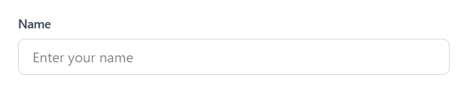

# Introduction to Tailwind CSS

<figure><figcaption></figcaption></figure>

Tailwind CSS is a popular utility-first CSS framework that provides a set of pre-built classes to rapidly build modern and responsive user interfaces. Unlike traditional CSS frameworks like Bootstrap or Foundation, Tailwind CSS does not have predefined components or styles. Instead, it focuses on providing a comprehensive collection of utility classes that can be combined to create custom designs.

The core philosophy of Tailwind CSS is to give developers complete control over the styling of their interfaces while providing a highly efficient and consistent way of building UIs. It achieves this by offering a large number of small utility classes that can be applied directly in the HTML markup.

<figure><figcaption></figcaption></figure>

### Features of Tailwind CSS 

Here are some key features and concepts of Tailwind CSS:

1.  #### Utility-First: 

    Tailwind CSS follows a utility-first approach, where individual classes directly define specific styles, such as margins, padding, typography, colors, and more. Developers can compose these utility classes to create complex designs without writing custom CSS.
2.  #### Responsive Design: 

    Tailwind CSS makes it easy to build responsive layouts by providing a range of responsive utility classes. These classes allow you to control the appearance of elements at different breakpoints, such as screens of different sizes.
3.  #### Customization: 

    While Tailwind CSS provides a comprehensive set of default utility classes, it also allows for easy customization. Developers can configure and extend the framework by modifying the default theme or creating their own utility classes.
4.  #### Developer Experience: 

    Tailwind CSS emphasizes developer productivity. It offers a highly efficient workflow by including features like JIT (Just-in-Time) mode, which generates CSS on-demand, eliminating unused styles and reducing the final file size.

To use Tailwind CSS, you need to install it as a dependency in your project and include its CSS classes in your HTML markup. You can either use the classes directly or create custom classes based on Tailwind's utility classes.

Tailwind CSS has gained popularity among developers due to its flexibility, ease of use, and ability to rapidly prototype and build user interfaces. It provides a solid foundation for creating modern and responsive designs while allowing for customization and maintaining a streamlined development workflow.

### For a more detailed article refer to the following:



